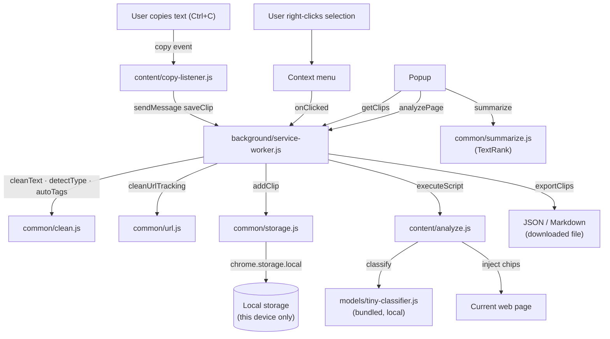

# Clarity Vault

**Everything you copy becomes clean, searchable, and summarized — 100% on your device.**


---

## Overview

Clarity Vault is a Manifest V3 browser extension that captures every piece of text you copy on the web, cleans it, and stores it locally so you can search, summarize, and analyze it later.

There are no accounts, no servers, no cloud sync, and no external AI APIs. Every feature runs entirely in your browser.

---

## Why Clarity Vault?

Most copy-paste workflows are lossy. You copy something interesting, paste it somewhere temporary, and two weeks later you have no idea where it came from. Cloud clipboard managers exist, but they upload your data to someone else's server.

Clarity Vault keeps a clean, searchable history of everything you copy — with the source URL, domain, and timestamp — without any of it leaving your device.

---

## Features

### Clipboard vault
- Auto-captures copy events from web pages (toggleable)
- Right-click context menu fallback for sites that block the copy event
- Cleans text: smart quotes normalized, tracking URLs stripped, whitespace collapsed
- Deduplication: identical clips within 5 minutes are not stored twice
- LRU cap: configurable maximum clip count (default: 500)
- AI-site-aware cleaning: extra formatting cleanup for ChatGPT, Claude, Gemini, Copilot, Perplexity

### Popup — 5 tabs

| Tab | What it does |
|---|---|
| **Recent** | Latest clips, list or compact tile view, quick-search |
| **Vault** | Filter by domain, tag, or starred; export JSON/Markdown; import |
| **Summary** | Local TextRank summary of any selected clip, no API required |
| **Analyze** | Labels paragraphs on the current page as Opinion / Promotional / Potentially Toxic / Neutral |
| **Settings** | Theme, auto-capture, max clips, URL cleaning, ignore list |

### Local summarizer
A TextRank implementation bundled with the extension generates extractive summaries from long clips. It selects the most important sentences using graph-based ranking — no generative AI, no internet connection.

### Page analyzer (CCE-lite)
Injects subtle chips onto page paragraphs classifying them as:
- **Opinion** — subjective language, hedging, first-person claims
- **Promotional** — sponsored content, affiliate terms, CTAs
- **Potentially Toxic** — hate speech markers, harassment keywords
- **Neutral/Factual** — no strong signal detected

Classification is done entirely locally using rule-based matching plus an optional bundled lexicon classifier. Hover any chip to see the reason and confidence score. Labels can be cleared at any time.

### Privacy-first design
- All data lives in `chrome.storage.local` — inaccessible to any website or server
- Zero network requests at runtime (verified — see Privacy section below)
- Export everything as JSON or Markdown at any time
- Delete everything in one click

---

## Screenshots

> *Screenshots will be added before the store submission. See [screenshots/README.md](screenshots/README.md) for the capture guide.*

| Recent tab | Vault search | Summary |
|---|---|---|
| *(coming soon)* | *(coming soon)* | *(coming soon)* |

| Page Analyzer | Settings / Options |
|---|---|
| *(coming soon)* | *(coming soon)* |

---

## How it works



---

## Architecture

```
extension/
├── manifest.json                  ← MV3 manifest
├── background/
│   ├── service-worker.js          ← central message dispatcher
│   └── xport.js                   ← export formatters (JSON, Markdown)
├── content/
│   ├── copy-listener.js           ← captures copy events (classic script)
│   ├── analyze.js                 ← page labeler (classic script)
│   └── inject.css                 ← chip + hover overlay styles
├── popup/
│   ├── index.html / styles.css / app.js   ← 5-tab popup (ES module)
├── options/
│   ├── index.html / styles.css / app.js   ← full settings page (ES module)
├── common/
│   ├── api.js                     ← chrome/browser API normalizer
│   ├── storage.js                 ← Clip + Settings CRUD
│   ├── clean.js                   ← text normalization, type detection, tagging
│   ├── url.js                     ← tracking param removal (30+ params)
│   └── summarize.js               ← TextRank summarizer
├── models/
│   └── tiny-classifier.js         ← optional local lexicon classifier
├── assets/                        ← extension icons
├── tests/
│   └── test-utils.js              ← Node-runnable smoke tests (25 cases)
├── screenshots/                   ← store screenshots (see screenshots/README.md)
└── docs/
    ├── ARCHITECTURE.md
    ├── PRIVACY.md
    ├── TESTING.md
    ├── ROADMAP.md
    └── RELEASE_CHECKLIST.md
```

See [docs/ARCHITECTURE.md](docs/ARCHITECTURE.md) for the full data flow and storage schema.

---

## Permissions

| Permission | Why it is needed |
|---|---|
| `storage` | Saves clips, settings, and UI preferences in `chrome.storage.local` |
| `activeTab` | Reads the current page when you click "Analyze this page" |
| `scripting` | Injects the copy listener and analyzer into pages |
| `contextMenus` | Adds a "Save selection" option to the right-click menu |
| `host_permissions <all_urls>` | Allows the copy-listener content script to be registered at runtime; used **only** when Auto-capture is explicitly enabled |

The extension requests **no optional permissions** beyond what is listed above. The `<all_urls>` host permission is declared so the scripting API can register the content script, but it is never used silently — it only becomes active when the user turns on Auto-capture and is revoked when they turn it off.

---

## Privacy

**Nothing leaves your device.**

- All data is stored in `chrome.storage.local` — private to this extension.
- Zero outbound network requests at any time (verified — DevTools Network tab shows nothing).
- No accounts, no sign-in, no telemetry, no error reporting.
- Summaries and page analysis run locally — no external AI API is ever called.
- Export or delete everything at any time from the popup or options page.

Full details: [docs/PRIVACY.md](docs/PRIVACY.md)

---

## Local summarization

The **Summary tab** uses a TextRank implementation bundled with the extension (`common/summarize.js`). It:

1. Splits the clip into sentences
2. Builds a similarity graph using token overlap
3. Runs power iteration (PageRank) to score each sentence
4. Returns the top-N highest-scoring sentences in original order

This is an **extractive** summarizer — it selects and returns existing sentences; it does not generate new text. The output is clearly labelled "Local Summary · Extractive · On-device" in the UI.

---

## Browser support

| Browser | Status | Notes |
|---|---|---|
| Chrome 109+ | ✅ Full | Primary target |
| Edge 109+ (Chromium) | ✅ Full | Same engine as Chrome |
| Firefox 109+ | ⚠ Partial | MV3 service worker supported; `persistAcrossSessions` for content scripts is not; copy listener must re-register on each session |
| Safari | ❌ Not supported | Safari uses a different extension format |

---

## Installation (unpacked — for development and review)

### Chrome / Edge
```
1. Open chrome://extensions  (or edge://extensions)
2. Enable Developer mode (top-right toggle)
3. Click "Load unpacked"
4. Select the extension/ folder (the one containing manifest.json)
```

### Firefox
```
1. Open about:debugging#/runtime/this-firefox
2. Click "Load Temporary Add-on"
3. Select extension/manifest.json
   (note: loads only until Firefox is closed)
```

> This extension is not currently published on the Chrome Web Store or Firefox Add-ons (AMO).

---

## Usage

### Capturing clips

1. Copy text on any web page as normal (`Ctrl+C` / `Cmd+C`).
2. The clip is saved automatically (if Auto-capture is on) or via the right-click menu.
3. Open the popup to see it in the **Recent** tab.

### Searching and filtering

- Type in the search bar to filter across all clip text, titles, domains, and tags.
- Use the **Vault** tab for domain, tag, and starred filters.

### Reading a summary

- Click any clip (in Recent or Vault) to open it in the **Summary** tab.
- The local TextRank summary appears at the top; the original text is below.
- Use "Copy summary" or "Copy original" to re-use the content.

### Analyzing a page

1. Open the popup while viewing an article or web page.
2. Go to the **Analyze** tab.
3. Click **Analyze this page**.
4. Paragraph chips appear on the page. Hover them to see the classification reason.
5. Click **Clear labels** to remove all chips.

### Exporting / importing

- **Vault** tab → Export JSON (full data with metadata) or Export Markdown (readable).
- **Vault** tab → Import JSON to restore from a backup.
- JSON format: `{ "version": 1, "exportedAt": <ms>, "clips": [ ...Clip[] ] }`

---

## Export format

### JSON
```json
{
  "version": 1,
  "exportedAt": 1748000000000,
  "clips": [
    {
      "id": "abc123def",
      "text": "The cleaned clip text...",
      "preview": "The cleaned clip text...",
      "sourceUrl": "https://example.com/article",
      "sourceTitle": "Article Title",
      "domain": "example.com",
      "type": "article",
      "tags": ["dev"],
      "createdAt": 1747999900000,
      "favorite": false,
      "truncated": false
    }
  ]
}
```

### Markdown
```markdown
# Clarity Vault Export

Exported: 2025-06-07T12:00:00.000Z

## Article Title — 6/7/2025, 12:00:00 PM

Source: https://example.com/article
Tags: #dev

The cleaned clip text...

---
```

---

## Development

### No build step required

This is plain vanilla JavaScript. Load the unpacked extension directly — no `npm install`, no bundler, no transpilation.

### Running tests

```bash
node tests/test-utils.js
```

25 smoke tests covering `clean.js`, `url.js`, and `summarize.js`.

### Packaging for submission

```bash
bash scripts/package.sh chrome   # → dist/clarity-vault-1.0.0-chrome.zip
bash scripts/package.sh firefox  # → dist/clarity-vault-1.0.0-firefox.zip
```

### File naming conventions

- Background / common / options: ES modules (`import`/`export`)
- Content scripts: classic scripts (no `import`/`export`) — required by MV3 content script constraints

---

## Known limitations

- The page analyzer does not work in iframes or Shadow DOM elements.
- The TextRank summarizer is extractive; it does not generate new text.
- The lexicon classifier produces occasional false positives on unusual phrasing.
- `chrome.storage.local` has a 10 MB default quota — rarely hit with the default 500-clip cap.
- `persistAcrossSessions: true` is not supported in Firefox for dynamically registered content scripts.

See [docs/ROADMAP.md](docs/ROADMAP.md) for planned improvements.

---

## Contributing

Issues and pull requests are welcome. Please check that:

1. `node tests/test-utils.js` passes (25/25).
2. The extension loads as unpacked in Chrome without console errors.
3. No network calls are introduced.
4. No external dependencies are added unless the value clearly justifies the complexity.

---

## License

MIT — see [LICENSE](LICENSE).

---

*Clarity Vault — everything you copy, locally yours.*
